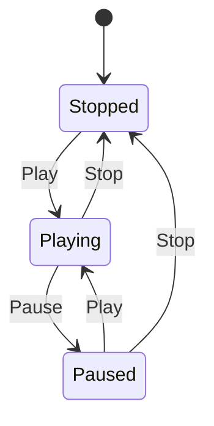
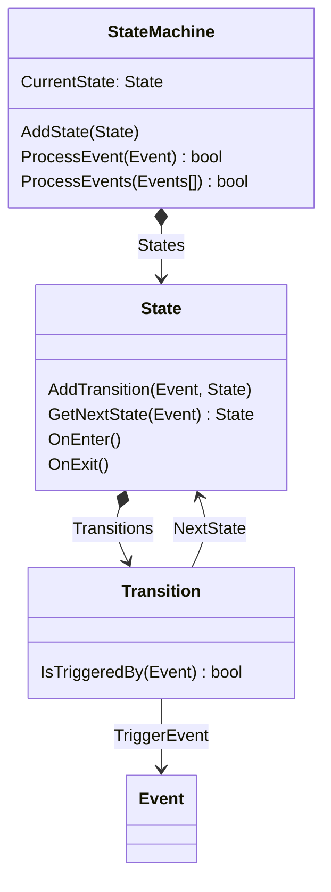

Ver [aquí](https://raw.githack.com/ucudal/PII_FSM_End/main/docs/html/classUcu_1_1Poo_1_1Fsm_1_1StateMachine.html).

## Introducción

Una **máquina de estados finitos** es un modelo computacional que realiza
cómputos de forma automática sobre una entrada para producir una salida. Está
formado por un alfabeto finito, un conjunto finito de estados, una función de
transición, un estado inicial y uno o más estados finales. Su funcionamiento
consiste en leer una secuencia de símbolos de ese alfabeto, ir cambiando de
estado según la función de transición, y detenerse en un estado final o de
aceptación que representa el resultado del cómputo.

Las máquinas de estado finito pueden ser utilizadas, entre otras situaciones,
para modelar casos en los que:

* Hay varios estados posibles

* Se puede estar en un solo estado a la vez

* Los cambios de un estado se producen ante la ocurrencia de ciertos eventos.

Un reproductor de música es uno de esos casos que puede ser modelado con una
máquina de estados finitos.

El reproductor puede estar en alguno de los siguientes estados, pero solo en uno
a la vez:

| Estado    | Descripción                                               |
| --------- | --------------------------------------------------------- |
| `Stopped` | No hay ninguna canción reproduciéndose.                   |
| `Playing` | Se está reproduciendo una canción.                        |
| `Paused`  | La reproducción de la canción está detenida temporalmente.|

El cambio de un estado a otro ocurre al presionar los botones `Play`, `Pause` o
`Stop` del reproductor:

| Estado actual | Evento  | Nuevo estado |
| ------------- | ------- | ------------ |
| `Stopped`     | `Play`  | `Playing`    |
| `Playing`     | `Pause` | `Paused`     |
| `Playing`     | `Stop`  | `Stopped`    |
| `Paused`      | `Play`  | `Playing`    |
| `Paused`      | `Stop`  | `Stopped`    |

Otros eventos, como el del botón `Play` durante el estado `Playing`, que no
provocan un cambio de estado, no aparecen en esta tabla y se ignoran.

¿Cómo corresponde este ejemplo con la definición de máquina de estados finitos?

* El alfabeto está formado por los símbolos `Play`, `Pause` y `Stop`, que
  que son los eventos que ocurren al presionar los botones correspondientes.

* El conjunto finito de estados está compuesto por `Stopped`, `Playing` y `Paused`.

* La función de transición, que es $f(estado actual, símbolo)=nuevo estado$,
  está en la tabla anterior.

* El estado inicial es `Stopped`.

* Los estados finales pueden ser `Stopped`, `Playing` y `Paused`; depende de qué
  botones se presionen.

En este caso, la "secuencia de símbolos" de entrada de la definición,
corresponde con los botones que se van presionando. Si quisiéramos validar que
una secuencia termina con el reproductor detenido, entonces el estado final
debería ser `Stopped`, y sólo las secuencias que terminan en ese estado serían
válidas. Por ejemplo, `Stopped` — `Play` → `Playing` — `Stop` → `Stopped` es una
secuencia válida, pero `Stopped` — `Play` → `Playing` — `Pause` → `Paused` no lo
es.

Una máquina de estados finitos, se puede mostrar con un diagrama, como el que
aparece a continuación:

## Objetivo

El desafío de este ejercicio es modelar una máquina de estados finitos genérica
primero, con clases para `State`, `Event` y `Transition`. Luego reutilizar esas
clases para el caso del reproductor de canciones.

Para facilitar la tarea, te damos un diagrama de clases mostrando las
responsabilidades y colaboraciones de esas clases:

La clase `StateMachie` tiene la responsabilidad de conocer múltiples `State`,
cuál de ellos es el `CurrentState`, agregar estados, y procesar uno o más
eventos.

La clase `State` tiene la responsabilidad de conocer una o más transiciones a
otros estados, determinar el próximo estado cuando ocurre un evento, y ejecutar
ciertas acciones cuando se entra y cuando se sale del estado.

La clase `Transition` tiene la responsabilidad de conocer qué evento la dispara
y cuál es el próximo estado.
