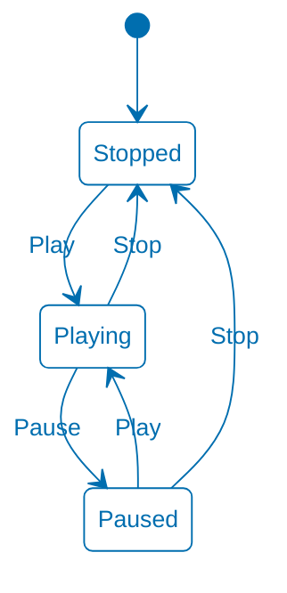
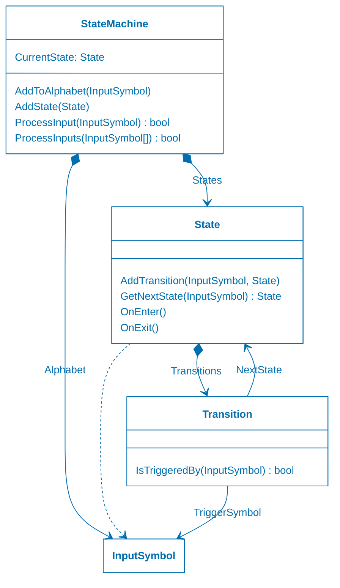

<!-- markdownlint-disable-next-line MD033 MD041 -->

# Universidad Católica del Uruguay

## Programación II

# Máquinas de estados finitos

## Introducción

Una **máquina de estados finitos** es un modelo computacional que realiza
cómputos de forma automática sobre una entrada para producir una salida. Está
formado por un alfabeto de símbolos finito, un conjunto finito de estados, una
función de transición, un estado inicial y uno o más estados finales. La función
de transición se puede entender como una tabla que define, dados un estado y un
símbolo, cuál será el próximo estado. Su funcionamiento consiste en leer una
secuencia de símbolos de ese alfabeto, ir cambiando de estado a medida que se
leen esos símbolos según la función de transición, y detenerse en un estado
final luego de leer el último símbolo.

Las máquinas de estados finitos pueden ser utilizadas, entre otras situaciones,
para modelar casos en los que:

* Hay varios estados posibles

* Se puede estar en un solo estado a la vez

* Los cambios de un estado se producen ante la ocurrencia de ciertos eventos.

Un reproductor de música, por ejemplo, es uno de esos casos que puede ser
modelado con una máquina de estados finitos.

El reproductor puede estar en alguno de los siguientes estados, pero solo en uno
a la vez:

| Estado    | Descripción                                               |
| --------- | --------------------------------------------------------- |
| `Stopped` | No hay ninguna canción reproduciéndose.                   |
| `Playing` | Se está reproduciendo una canción.                        |
| `Paused`  | La reproducción de la canción está detenida temporalmente.|

El cambio de un estado a otro ocurre al presionar los botones `Play`, `Pause` o
`Stop` del reproductor:

| Estado actual | Entrada  | Nuevo estado |
| ------------- | -------  | ------------ |
| `Stopped`     | `Play`   | `Playing`    |
| `Playing`     | `Pause`  | `Paused`     |
| `Playing`     | `Stop`   | `Stopped`    |
| `Paused`      | `Play`   | `Playing`    |
| `Paused`      | `Stop`   | `Stopped`    |

Otras entradas, como la del botón `Play` durante el estado `Playing`, que no
provocan un cambio de estado, no aparecen en esta tabla y se ignoran.

¿Cómo corresponde este ejemplo con la definición de máquina de estados finitos?

* El alfabeto está formado por los símbolos `Play`, `Pause` y `Stop`, que que
  son las entradas que recibe la máquina de estados finitos al presionar los
  botones correspondientes.

* El conjunto finito de estados está compuesto por `Stopped`, `Playing` y
  `Paused`.

* La función de transición, que es $f(estado actual, símbolo)=nuevo estado$,
  está en la tabla anterior.

* El estado inicial es `Stopped`.

* Los estados finales pueden ser `Stopped`, `Playing` y `Paused`; depende de qué
  botones se presionen.

En este caso, la "secuencia de símbolos" de entrada de la definición,
corresponde con los botones que se van presionando. Si quisiéramos validar que
una secuencia termina con el reproductor detenido, entonces el estado final
debería ser `Stopped`, y sólo las secuencias que terminan en ese estado serían
válidas. Por ejemplo, `Stopped` — `Play` → `Playing` — `Stop` → `Stopped` es una
secuencia válida, pero `Stopped` — `Play` → `Playing` — `Pause` → `Paused` no lo
es.

Una máquina de estados finitos, se puede mostrar con un diagrama, como el que
aparece a continuación:

## Objetivo

El desafío de este ejercicio es modelar una máquina de estados finitos genérica
primero, con clases para `State`, `Input` y `Transition`. Luego reutilizar esas
clases para el caso del reproductor de canciones.

Para facilitar la tarea, te damos un diagrama de clases mostrando las
responsabilidades y colaboraciones de esas clases:

La clase `StateMachine` tiene la responsabilidad de conocer múltiples `State`,
cuál de ellos es el `CurrentState`, agregar estados, y procesar una o más
entradas.

La clase `State` tiene la responsabilidad de conocer una o más transiciones a
otros estados, determinar el próximo estado cuando la máquina recibe una
entrada, y ejecutar ciertas acciones cuando se entra y cuando se sale del
estado.

La clase `Transition` tiene la responsabilidad de conocer qué entrada la dispara
y cuál es el próximo estado.

> [!TIP]
>
> Agrega las clases `StateMachine`, `State`, `Transition` e `Input` en la
> carpeta `src/Library/Base` y las clases del reproductor de música en
> `src/Library/Player`.

## Uso de 

Es posible usar GitHub Copilot en este repositorio. Consulta [cómo usar Copilot
para aprender](./COPILOT.md).
